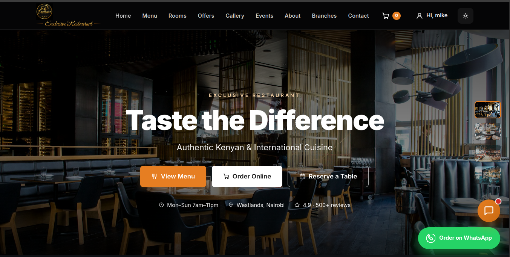
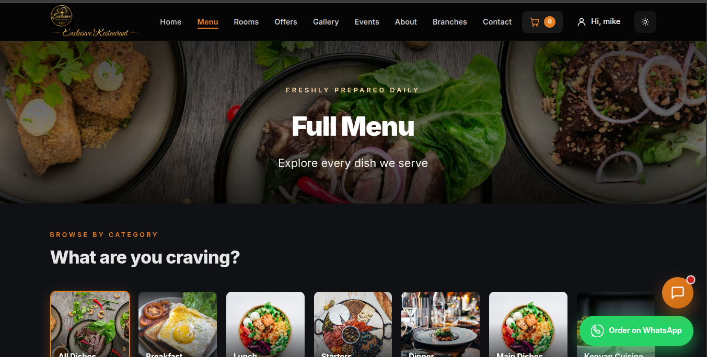
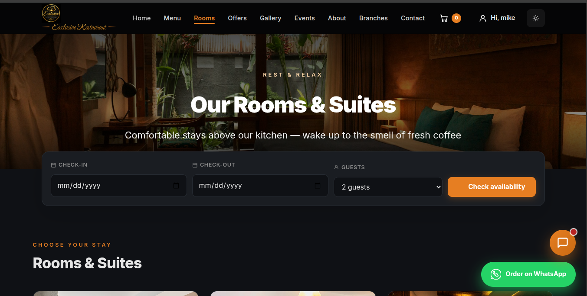
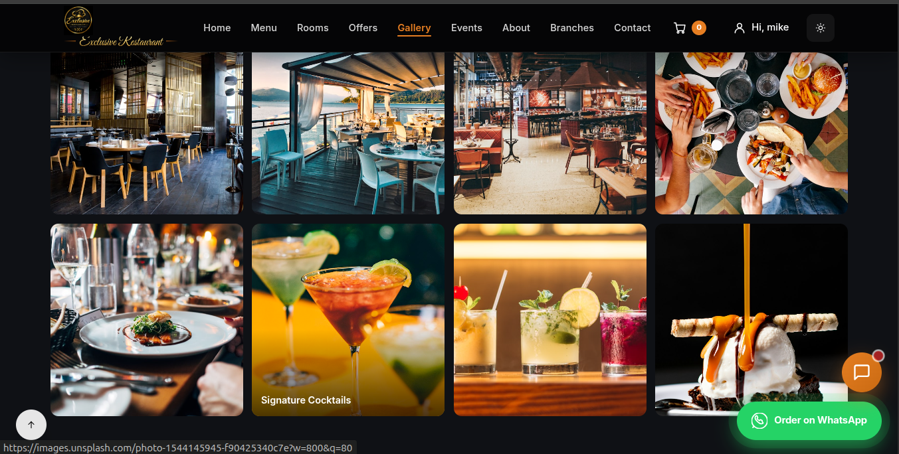
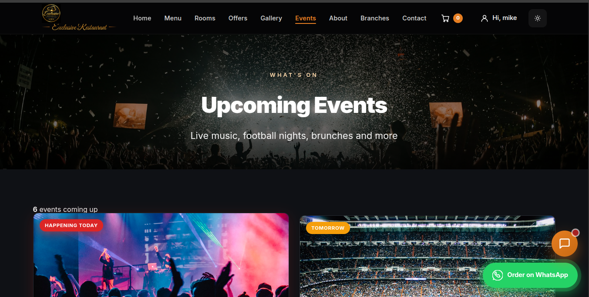
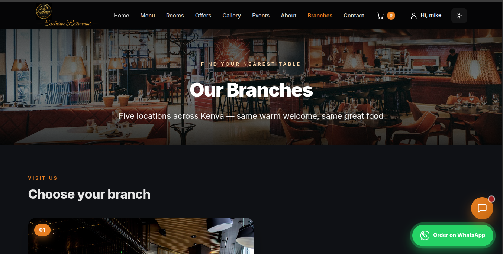
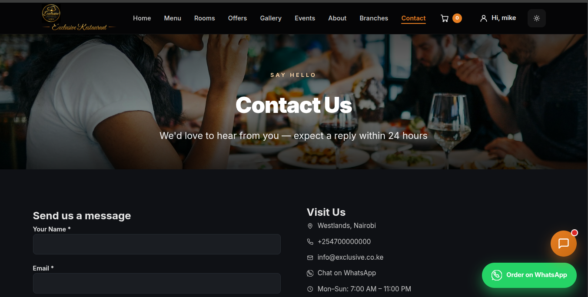
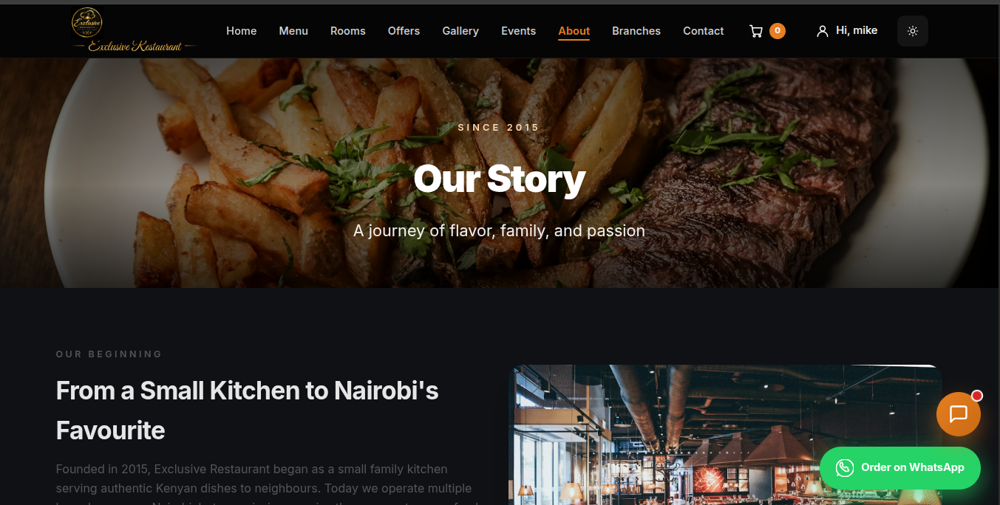

# 🍽️ Exclusive Restaurant

A modern, full-featured restaurant website with online ordering, table reservations, and room bookings — built with **PHP**, **MySQL**, and **vanilla JavaScript**.

---

## 📖 Table of Contents

- [About](#-about)
- [Features](#-features)
- [Tech Stack](#-tech-stack)
- [Screenshots](#-screenshots)
- [Project Structure](#-project-structure)
- [Local Setup](#-local-setup)
- [Database Setup](#-database-setup)
- [Configuration](#-configuration)
- [Usage](#-usage)
- [Admin Dashboard](#-admin-dashboard)
- [Deployment](#-deployment)
- [Security](#-security)
- [Roadmap](#-roadmap)
- [License](#-license)
- [Contact](#-contact)

---

## 📌 About

**Exclusive Restaurant** is a complete restaurant management system that serves both customers and staff.

For **customers**, it offers a fast, mobile-friendly way to browse the menu, place food orders, reserve tables, and book rooms — all in one place.

For **owners and staff**, it provides a powerful admin dashboard to manage the menu, orders, reservations, rooms, promotions, reviews, branches, and site settings — with no technical knowledge required.

The project is designed to be deployed on any shared hosting environment (tested on **AwardSpace**) as well as run locally with **XAMPP**.

---

## ✨ Features

### 🧑‍🍳 Customer-Facing

- **Homepage** — Hero slideshow, featured dishes, promotions, reviews, and branch locations
- **Menu** — Browse by category, search, filter (vegetarian, spicy, popular), sort by price
- **Shopping cart** — Add, update quantity, remove items; persisted in session
- **Online ordering** — Delivery or pickup, checkout with delivery address
- **Order tracking** — Real-time status updates (Received → Preparing → Ready → Out for delivery → Delivered)
- **Table reservations** — Pick a date, time, party size, and branch
- **Room bookings** — 18 rooms across 4 tiers (Budget, Standard, Deluxe, Suite); live availability check
- **Offers & promotions** — Discount codes and featured deals
- **Events** — Live music, themed nights, seasonal events
- **Gallery** — Photo grid with lightbox
- **Branches** — Locations with embedded Google Maps
- **Contact form** — Sends messages to admin inbox
- **User accounts** — Register, login, forgot password (modal-based reset flow)
- **WhatsApp integration** — Floating button for direct orders and enquiries
- **Dark mode** — Theme toggle stored in localStorage
- **Fully responsive** — Mobile-first design, works on all screen sizes

### 🛠️ Admin Dashboard

- **Dashboard** — Sales overview, recent orders, quick stats
- **Menu management** — Add, edit, delete items; upload images; toggle availability
- **Categories** — Organise menu items into groups
- **Orders** — View, update status, cancel
- **Reservations** — Approve, decline, view guest details
- **Rooms** — Add, edit, activate/deactivate rooms
- **Room bookings** — View all bookings, update status (pending/confirmed/cancelled/completed)
- **Promotions** — Create discount codes with expiry
- **Reviews** — Approve or reject customer reviews
- **Branches** — Manage locations
- **Contact messages** — Read customer enquiries
- **Settings** — Site name, tagline, contact info, delivery fee, WhatsApp number, social links

### 🔒 Security

- **CSRF protection** on all POST forms
- **Password hashing** using `password_hash()` (bcrypt)
- **PDO prepared statements** — protection against SQL injection
- **HTML escaping** on all user output — protection against XSS
- **Session-based authentication** with admin role checks
- **File upload validation** — MIME type and size checks
- **`.htaccess` hardening** — blocks sensitive files, bad user agents, directory listing

---

## 🧰 Tech Stack

| Layer | Technology |
|---|---|
| **Backend** | PHP 8.x (no framework) |
| **Database** | MySQL 8.x / MariaDB |
| **Frontend** | HTML5, CSS3, vanilla JavaScript |
| **Fonts** | Inter, Great Vibes (Google Fonts) |
| **Icons** | Inline SVG (custom icon helper) |
| **Payments** | M-Pesa Daraja API (STK Push) |
| **Email** | PHP `mail()` / SMTP (configurable) |
| **Maps** | Google Maps embed |
| **Hosting** | AwardSpace (tested), any LAMP stack |

---

## 🖼️ Screenshots

## 🖼️ Screenshots

## 🖼️ Screenshots

### 🏠 Homepage

### 🍽️ Menu

### 🛒 Shopping Cart

### 🛏️ Rooms & Suites

### 📸 Gallery

### 🎉 Events

### 🏢 Branches

### 📞 Contact

### 🏠 About

---

## 📁 Project Structure
